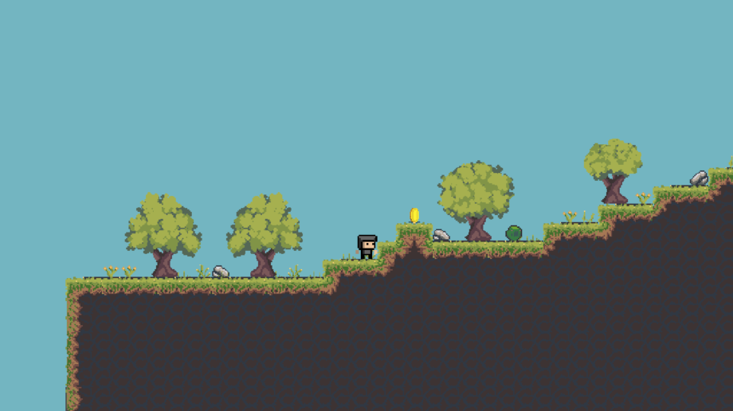

# BCSH1 Semestralní práce
- Autor: Petr Mrva
- Varianta: B - Jednoduchá počítačová hra
- Téma: Jump Journey (Super Mario like)
- Engine: GODOT

*Ukázka prostředí a hlavního hrdiny*

## Instalace a spuštění
- Stáhněte/Naklonujte repozitář
- Otevřete projekt v Godot Engine (4.6.1 s podporou .NET/C#)
- Pro správné fungování C# skriptů je vyžadováno nainstalované .NET SDK
- Spusťte hlavní scénu main_menu.tscn (klávesa F5)

## Seznam funkcionalit
### **Sledované entity:**
- **Hráč**
- **Nepřátelé** (Jednoduchá AI - Slizák)
- **Sbíratelné předměty** (Coins)
- **Cílový objekt levelu**

### **Pohyb a animace:**
- Realizace plynulého fyzikálního pohybu hráče (Běh, Skok)

### **Úrovně:**
- Tři graficky i náročností odlišná prostředí: Les, Jeskyně, Podhradí

### **Perzistence dat:**
- Ukládání a načítání nasbíraných Korunek a progresu do JSON souboru.

## **Ovládání hry**
| Akce | Klávesa |
| :--- | :--- |
| Pohyb | `A` / `D` nebo směrové šipky `←` `→` |
| Skok | `W`, `Mezerník` nebo šipka nahoru `↑` |
| Běh | Držení klávesy `Shift` + pohyb |
| Interakce | `E` (u cílových objektů) |
| Restart | `R` |
| Pauza | `Esc` |

## **Dokumentace**
Hra využívá objektově orientovaný přístup v C# a specifické funkce Godotu:

### Singleton Pattern (Autoload)
- **GameManager**: Správa herních dat (mince, levely, úmrtí). Zajišťuje perzistenci dat.
- **Sounds**: Globální manažer pro audio, umožňující plynulou hudbu napříč scénami.

### Perzistence dat (Save/Load)
- Postup se ukládá do `savegame.json`. Ukládá se index levelu, úmrtí, unikátní ID mincí a souřadnice hráče (X, Y).

### Fyzika a AI
- **Player**: Implementace přes `CharacterBody2D` s vlastní gravitací.
- **Enemy AI**: Využití `RayCast2D` pro detekci hran a hráče. Logika útočného výpadu při detekci.

### Využití AI
- Nástroje generativní AI (Google Gemini) byly využity jako konzultant pro:
  - Návrh struktury JSON serializace.
  - Debugování asynchronních operací (`async/await`) u audio systému.
  - Návrh Singleton architektury.
  *Výsledný kód byl autorem revidován a plně integrován do logiky projektu.*

### Externí assety:
- Free - Hero's Journey - Moon Graveyard - [[odkaz]](https://anokolisa.itch.io/moon-graveyard)
- Free Chibi Skeleton Crusader Character Sprites - [[odkaz]](https://craftpix.net/freebies/free-chibi-skeleton-crusader-character-sprites/)
- Pixel Valley | Forest and Cave (Revamped) - [[odkaz]](https://kauzz.itch.io/pixel-valley-plataform-tiles)
- Tipsy’s PixelScroller Pack (v0.2) - [[odkaz]](https://tipsycontent.itch.io/tipsys-pixel-scroller-pack)
- 2D 16x16 characters and stuff - [[odkaz]](https://segfault5814.itch.io/2d-16x16-characters-and-stuff)
- 16x16 Underground Passage - [[odkaz]](https://orbitpanda.itch.io/16x16-underground-passage)
- Kingdom pxels - [[odkaz]](https://favi-gmdv.itch.io/kingdom-pxel)
- Characters Animations Asset Pack - [[odkaz]](https://oboropixel.itch.io/characters-animations-asset-pack)
- Gwenchana Regular - [[odkaz]](https://www.1001fonts.com/gwenchana-font.html)
- Sound Efects(Music)
  - Universfield - [[odkaz]](https://pixabay.com/users/universfield-28281460/)
  - XtremeFreddy - [[odkaz]](https://pixabay.com/users/xtremefreddy-32332307/)
  - ike_machie - [[odkaz]](https://pixabay.com/users/ike_machie-53789436/)
  - MagiaZ - [[odkaz]](https://pixabay.com/users/magiaz-10236927/)
  
### Tutoriály a studijní materiály:
- Brackeys  - [[odkaz]](https://youtu.be/LOhfqjmasi0?si=Q3sfD7PDKcFus0cP)
- Code It All - [[odkaz]](https://youtu.be/rPHmO833O_8?si=-nY24pYj8g-poM5j)
- DeeRagHooGames - [[odkaz]](https://youtu.be/VwbD5_c7Bq0?si=mhcQoElMRKE2mw3Q)
- Coco Code - [[odkaz]](https://www.youtube.com/watch?v=zHYkcJyE52g)
